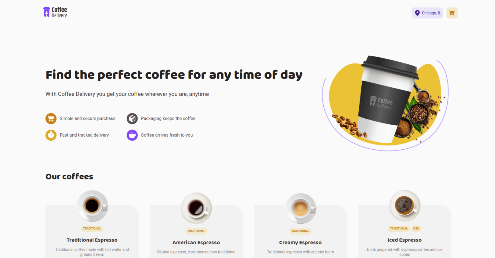

# Coffee Delivery



## Sobre

Esse é um projeto simples de uma simulação de um mercado online de entrega de café onde você pode comprar todos os seus cafés favoritos, que foi construído para treinar conceitos do React como construção de interfaces.

## Instalação

```bash
git clone https://github.com/manoguii/coffee-delivery.git
```

- Para rodar o projeto localmente
  1. Instale as dependências ```npm install```
  2. Execute a aplicação. ```npm run dev```
  3. Acesse `http://localhost:3000`

## Tecnologias

Algumas tecnologias utilizadas para construção da aplicação.

- [ReactJS](https://reactjs.org/)
- [TypeScript](https://www.typescriptlang.org/)
- [Styled Components](https://styled-components.com/)
- [React Hook Form](https://www.react-hook-form.com/)
- [Zod](https://zod.dev/)
- Vite

---

<center>Made with 💙 by Guilherme David</center>
